## Manjaro 安装配置教程


### 基本安装

#### 下载镜像

去manjaro官方下载系统镜像：https://manjaro.org/download/

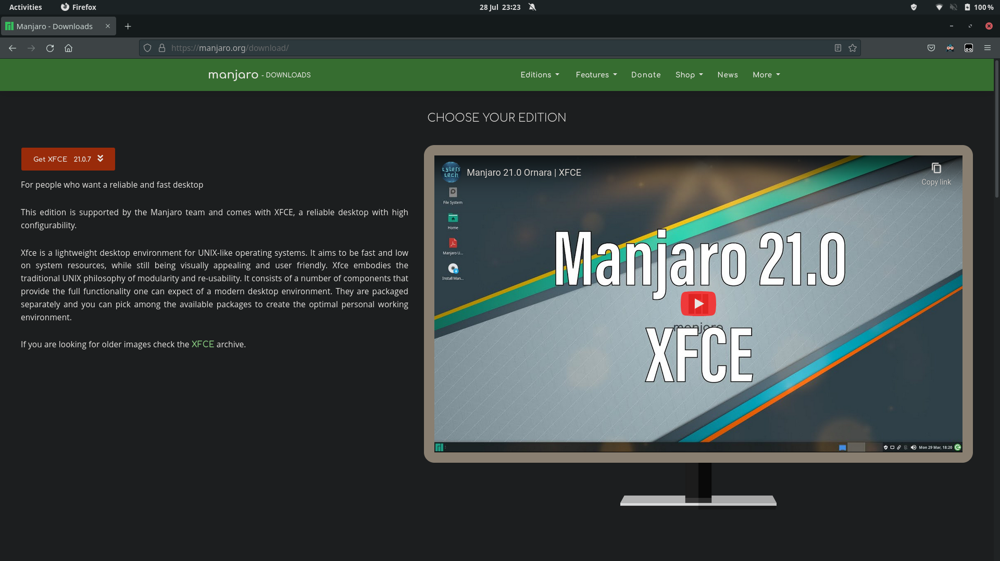

这里有三个版本，我个人使用的是gnome版本，区别在于用的桌面不同，可以根据自己喜好进行选择，我这里仅仅对已gnome进行说明

#### 制作U盘起动器

下载u盘起动器制作工具rufus：http://rufus.ie/

![[rufus screenshot]](1.assets/rufus_zh_CN.png)

根据示意图所示，插入U盘，点击 **开始**  即可。<font color=red>U盘会被格式化，请先备份其中数据</font>

#### 分出空白区域

- 右键点击开始菜单，选择【磁盘管理】。

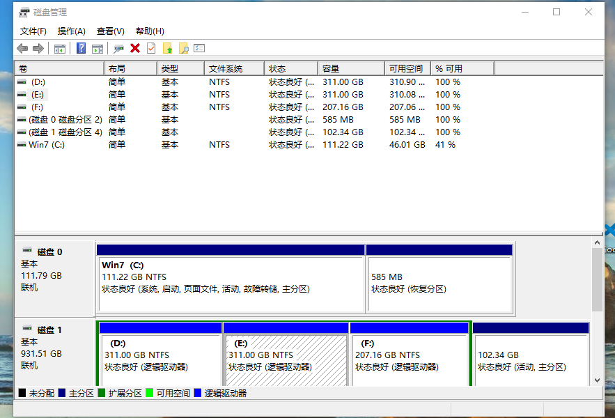

- 右击想要压缩的盘选择压缩卷。

- 出现可压缩文件大小后自行选择。

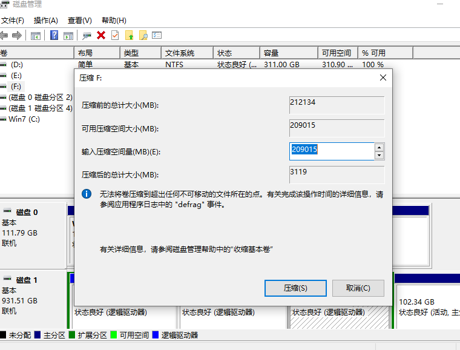

- 压缩。
- 关机


#### 更改启动顺序

- 插入U盘

1:开机狂按 [F2]/[ESC]/[F12]/[DEL]，来进入bios，具体方法根据不同主板不同，例如我是联想的电脑，那就按F2，<font color=red>如果说一直进不去bios，先检查是否自己windows开启快速启动</font>

2:找到[Secure Boot] 这一项，把它关掉(图来自同学)

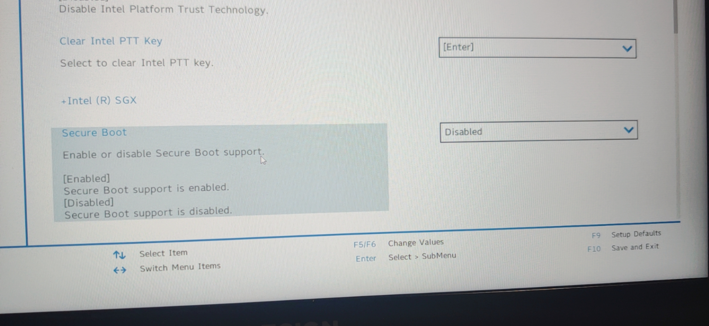

3:在启动项优先性上把U盘放在前面，具体看主板bios界面注释（图来自同学）

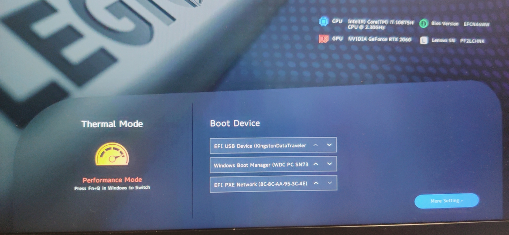

4:保存更改，并启动

#### 安装

U盘进出之后直接安装，可能会卡在分区这一步，因为不知道怎么选择，这时候你只要记住能把你当时留的位置选中就行，就那么几个按钮，大不了挨个实验（手动狗头），图来自同学

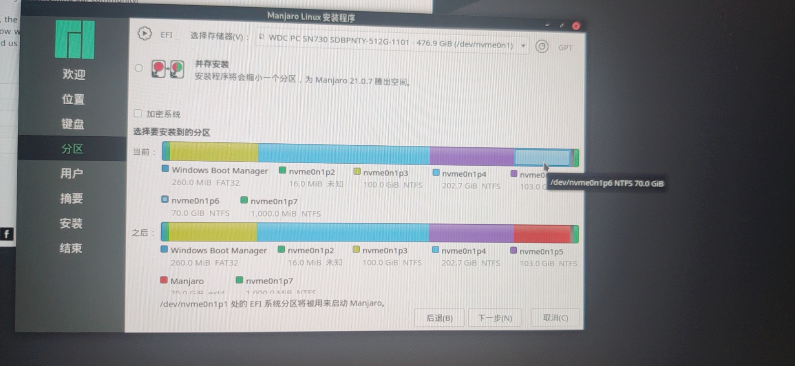

装上之后关机，拔下U盘，再开机，不出意外就能进去了

在你进入系统之后应该会让你更新，更新完毕重启即可。如果说更新后<font color=red>无法调整shell主题</font>，请搜索extension，把user-theme这项打开，至于如何调整主题，请看下面美化一栏。

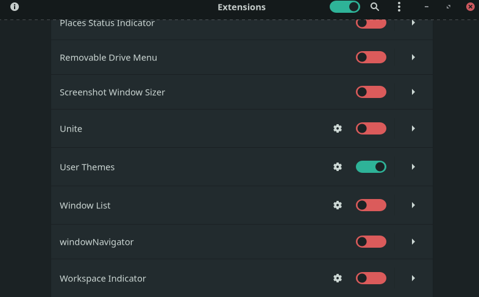

#### 开启防火墙

找到**[FireWall]**，点开，其实对于一般用户没必要，不过点开总比不点开强吧。

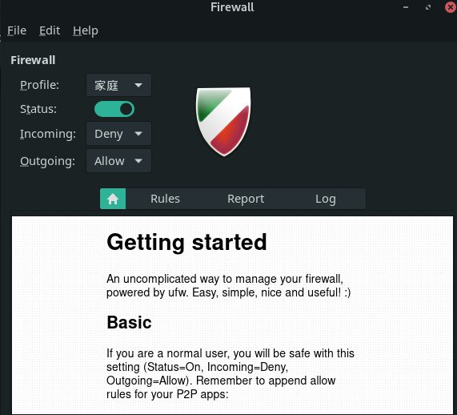


### 软件管理说明


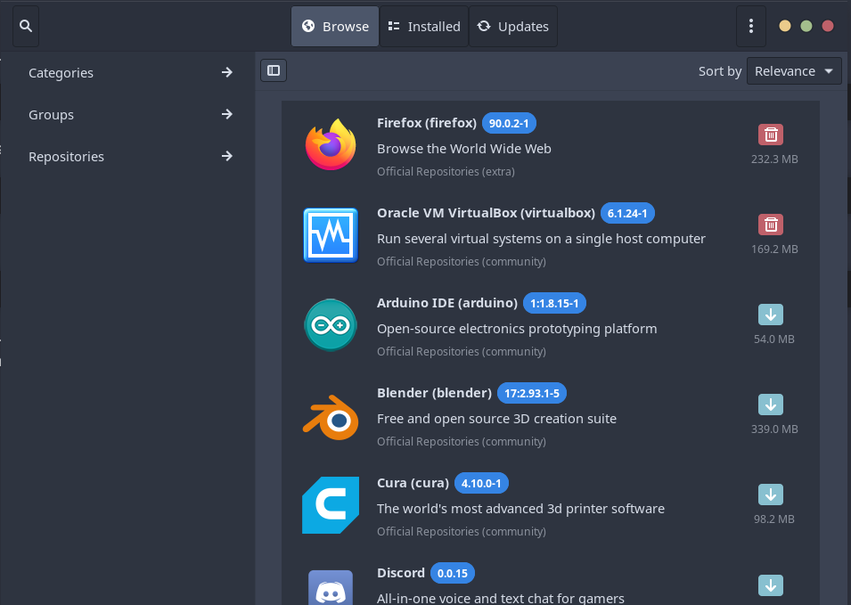

manjaro默认是有<font color=red>图形化</font>界面的，你可以在这里面选择，安装其他软件，你也可以选择<font color=red>命令行</font>安装软件，比如你要安装neovim

```bash
sudo pacman -S neovim
```

至于所谓命令行，就是下面这个东西


点开，我们的命令就在这里输入。

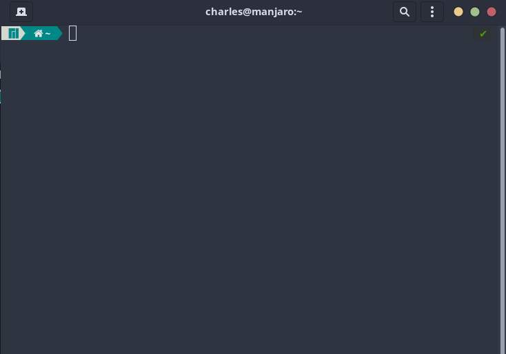

当然你也可以选择图形化安装

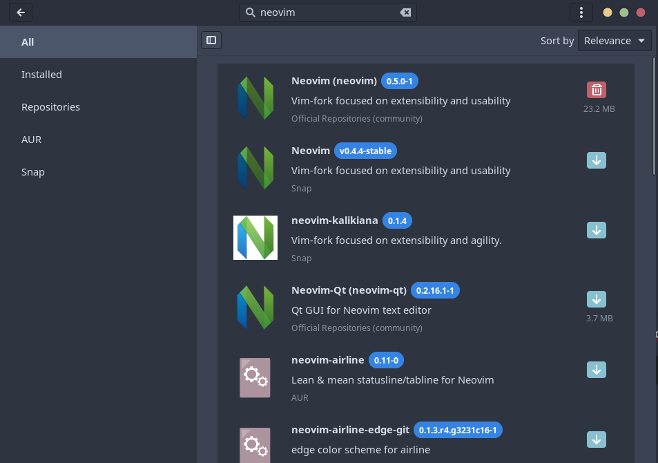

如果说<font color=red>速度比较慢</font>的话，建议调整软件源，在general里面把镜像地址调成中国。

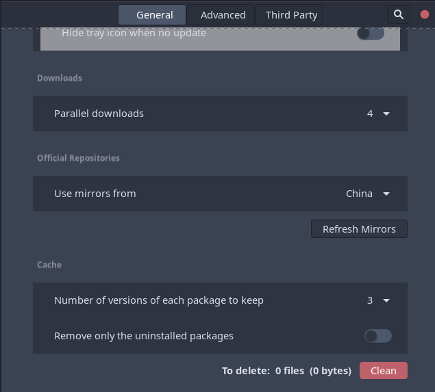


#### 开启aur源

manjaro是默认没有开放aur源的，我们来开启aur源，这里可能有同学会问了，aur是什么？下面给大家科普一下，manjaro是在<font color=red>archlinux</font>的基础上进行包装分发的发行版，保证了<font color=red>稳定性，以及易用性</font>，manjaro有自己的官方软件源，而aur作为arch一个巨大优势所在：你几乎可以找到所有想要的包，但是这些包大都是有用户自己维护的，不能保证质量，不过活跃度高的包基本是可用的。

下面开启aur源，右上角有三个点，点进去，perference而后输入密码

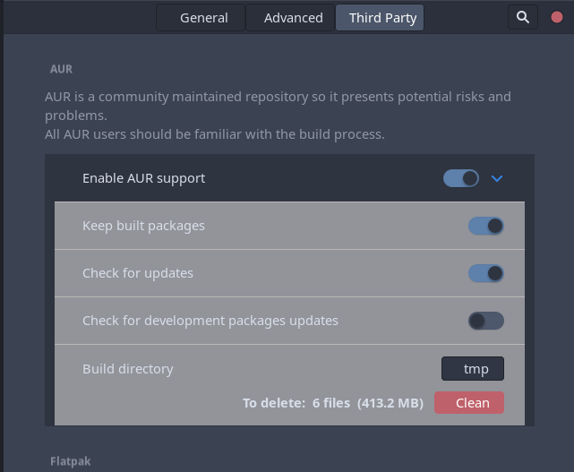

在Third Party里面把他打开。好，下面你就可以安装aur软件了，比如说你要安装vscode：

```bash
pamac build visual-studio-code-bin
```

对于aur里面包的安装，我们亦可以使用yay来进行管理，yay是一个用go语言开发的软件管理工具。

首先安装yay

```bash
sudo pacman -S yay
```

比如这时候你要安装vscode：

```bash
yay -S visual-studio-code-bin
```

这里科普一下包的管理软件，不同的linux发行版采取了不同的软件管理系统，比如manjaro采取的就是pacman和pamac，而其余像ubuntu和centos，采用的也是不同的管理软件，就安装neovim为例：

ubuntu:

```bash
sudo apt-get install neovim
```

centos

```bash
sudo yum install neovim
```


下面介绍一下一些基本的常用的命令：

- 对于整个系统进行更新：

```BASH
sudo pacman -Syu 
```

- 删除单个软件包，保留其全部已经安装的依赖关系

```BASH
sudo pacman -R package_name
```

- 安装或者升级单个软件包，或者一列软件包（包含依赖包），使用如下命令：

```bash
sudo pacman -S package_name1 package_name2 ...
```

- 从 AUR 安装软件包yay 安装命令不需要加 sudo

```bash
yay -S package 
```

- 升级所有已安装的包

```bash
yay -Syu
```

我们看到很多命令前面都有<code>sudo</code>这样的字样，意思是以“<font color=red>超级管理员</font>”身份运行，简单理解为有<font color=red>最高权限</font>的用户，你打上这行命令之后得输入密码，举个栗子，就好比存折放在保险箱里，虽然你和你对象住一个房子，但是保险箱只有人家才能打开，同样的，你是电脑的一个用户，但是有些操作你权限不够不能完成，linux出于安全性考虑，系统中会有一个叫做“root”的用户，这个用户拥有绝对控制权，你干有些事得经过他，一旦你有root权限，那linux默认你会对所有行为负责，例如一键删库跑路命令：<code>rm -rf / * </code>，相反，你有些操作，系统会提示你没有权限，防止被你玩坏，这也是一种自我保护，所以没事别老sudo。


#### 配置git

因为git的话速度在国内是比较慢的，而我们用linux会大量用到git，如果你不愿意就为了一个git去开代理，那么我建议是采用下面的方案：

- 安装git

```bash
sudo pacman -S git
```

- 配置git代理

```shell
git config --global url."https://hub.fastgit.org".insteadOf https://github.com
```

  除了fastgit，还有cnpmjs：https://github.com.cnpmjs.org/


### 配置中文输入法：

首先安装vim，我们下面会用到

```bash
sudo pacman -S vim
```

- 安装输入法框架

```bash
pamac build fcitx5-im 
```

而后配置环境

```bash
vim ~/.pam_environment
```

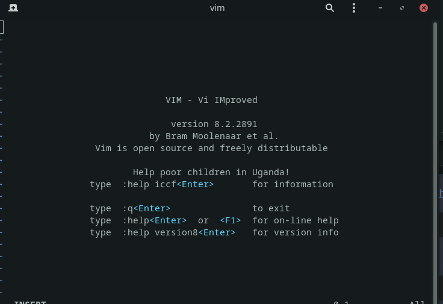

然后把下面这段复制进去

```shell
GTK_IM_MODULE DEFAULT=fcitx
QT_IM_MODULE  DEFAULT=fcitx
XMODIFIERS    DEFAULT=\@im=fcitx
SDL_IM_MODULE DEFAULT=fcitx
```

可能对于初学者来说不太会用vim，下面说一下简单流程

在键盘上按<code>i</code>是进入<font color=red>编辑模式</font>，按下<code>:w</code>是<font color=red>保存</font>，<code>:q</code>是<font color=red>退出</font>。<code>:q!</code>是<font color=red>关闭但是不保存</font>。<code>ESC</code>是退出<font color=red>编辑模式</font>。

所以你应该先按<code>i</code>进入编辑模式，然后把那段复制进去，而后<code>ESC</code>退出编辑模式，然后<code>:w</code>保存，<code>:q</code>退出。

- 安装rime引擎

```bash
sudo pacman -S fcitx5-rime   
```

- 安装四叶草输入法

```
pamac build rime-cloverpinyin 
```

  四叶草拼音项目主页：www.github.com/fkxxyz/rime-cloverpinyin

- 安装词库：

```bash
pamac build fcitx5-pinyin-moegirl-rime
```

相关项目在AUR里：https://aur.archlinux.org/packages/fcitx5-pinyin-moegirl-rime/

如果不想用的话可以可以搜一下其他拼音库：

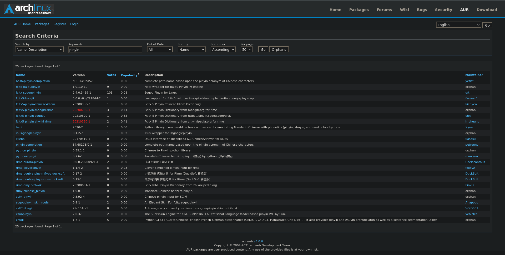

而后关机重启，打开fctix5设置，在右边搜索rime，然后添加到输入方案里面。

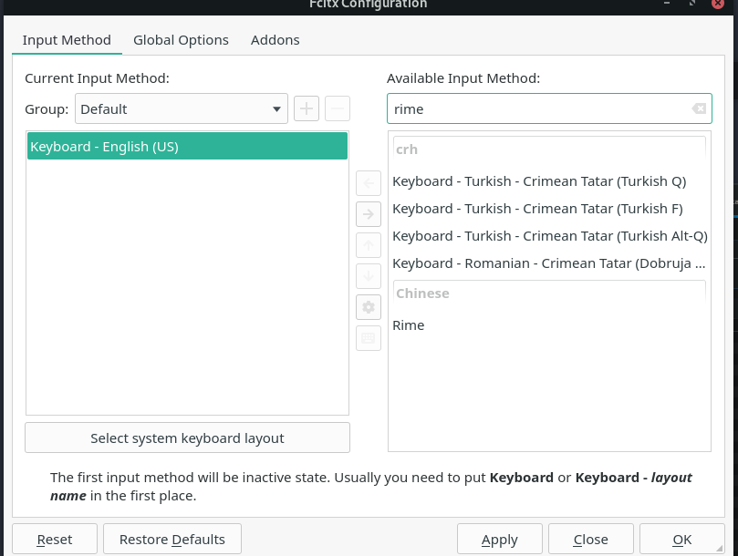

测试：随便找个浏览器输入，按下<font color=red>ctrl +空格</font>看看是否转变。

问题：如果有天发现打字变成了繁体字，按下<code>F4</code>，找到简体字就可。

#### 配置主题

```bash
pamac -S fcitx5-material-color
```

本主题项目主页：https://github.com/hosxy/Fcitx5-Material-Color

我个人选择的nord主题：https://github.com/ayamir/fcitx5-nord

- 使用git克隆项目

```bash
git clone https://github.com/tonyfettes/fcitx5-nord.git
```

- 进入文件夹

```bash
mkdir -p ~/.local/share/fcitx5/themes/
cd fcitx5-nord
```

- 把文件复制到i输入法相应位置

```bash
cp -r Nord-Dark/ Nord-Light/ ~/.local/share/fcitx5/themes/
```

然后更改输入法设置

```bash
vim ~/.config/fcitx5/conf/classicui.conf
```

把下面这些加进去

```bash
Theme=Nord-Dark
# or
Theme=Nord-Light
```

看你想启用dark主题还是light主题了，我个人启用的是dark主题。


### 软件安装

下面说一下怎么找软件，首先你可以像前面那样在图形化工具里面寻找软件，也可以在aur官方源里面寻找，比如说你要安装chrome，https://aur.archlinux.org/packages/?O=0&SeB=nd&K=google-chrome&outdated=&SB=n&SO=a&PP=50&do_Search=Go

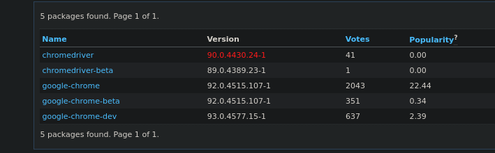

右边两栏会很清楚的显示相关信息，那我们就选择那个看起来最靠谱的google-chrome。

```bash
pamac build google-chrome
```

下面说一下个人在用的一些软件：

- Yesplaymusic，这是一个第三方的网易云音乐客户端


项目地址：https://github.com/qier222/YesPlayMusic

```bash
pamac build yesplaymusic
```

如果想要全平台听歌的话可以选择 FeelUown：https://github.com/feeluown/FeelUOwn

```bash
pamac build feeluown
```

- typora，这个是个人用起来最舒服的markdown编辑器，本教程也是在typora下配合nord主题写成的。

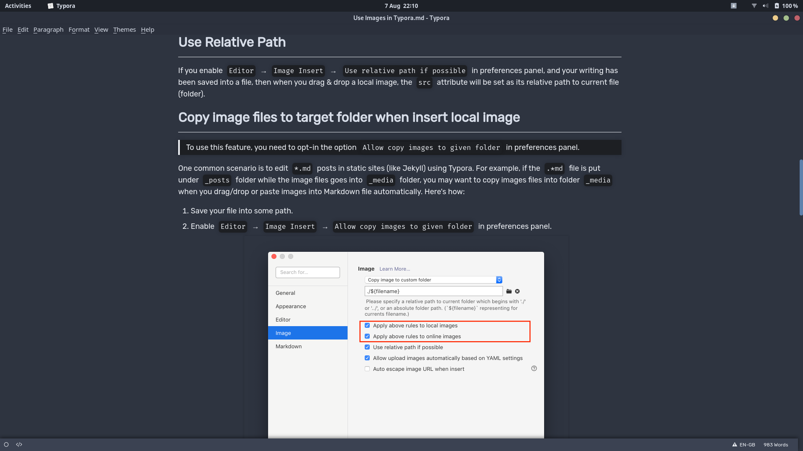

```bash
pamac build typora
```

- 开源多线程下载工具aria2+persepolis

```bash
sudo pacman -S aria2
pamac build persepolis
```

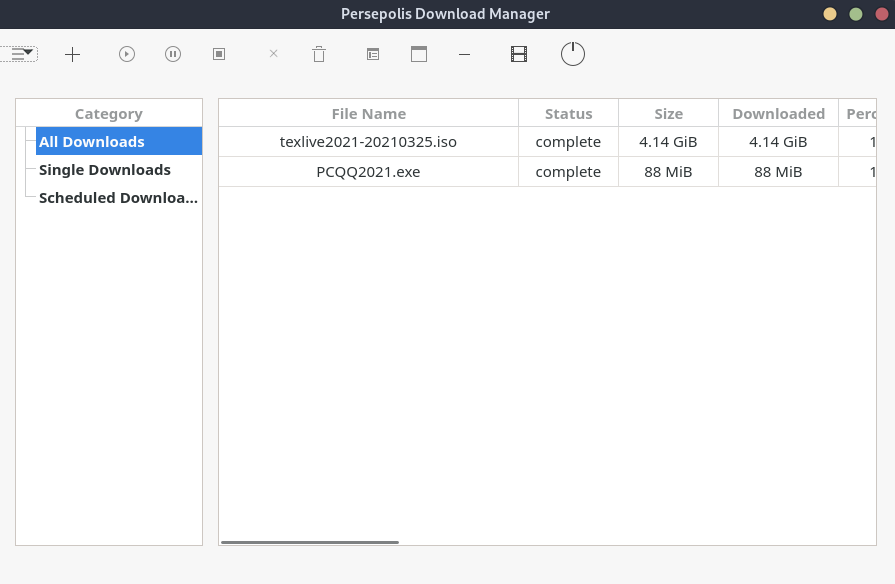

aria2:https://github.com/aria2/aria2

persepolis:https://github.com/persepolisdm/persepolis

aria2是一个多线程的下载工具，persepolis相当于aria2的一个图形化界面，下载时候就不必去跑命令行了，而persepolis也有相应的浏览器插件，配合起来十分好用。


- 浏览器插件：

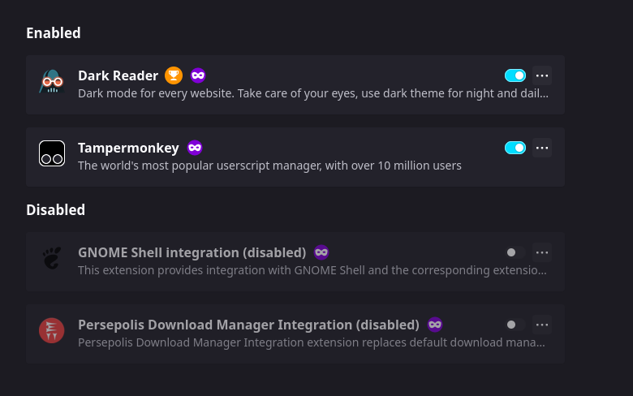

其中darkreader顾名思义，是调整浏览器颜色为暗色：

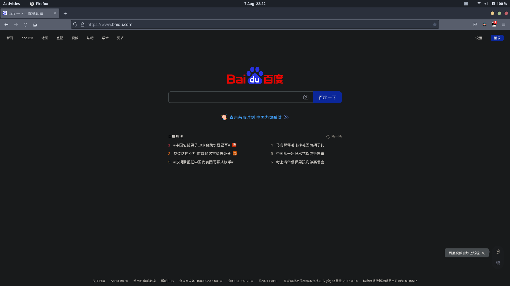

而第二个tempermonkey则是一个相当好用的东西，在greasy-fork：https://greasyfork.org/里面你可以挑选自己想要使用的脚本，下面是我个人一直启用的一些脚本：

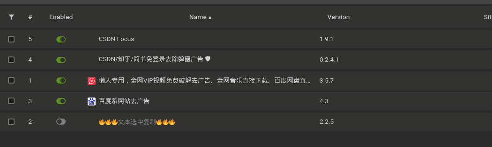

- stacer，这是一个垃圾清理加进程启动项管理等合一的工具：

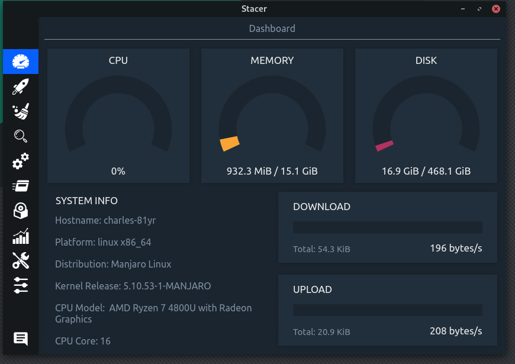

像垃圾清理，启动项管理什么都没问题

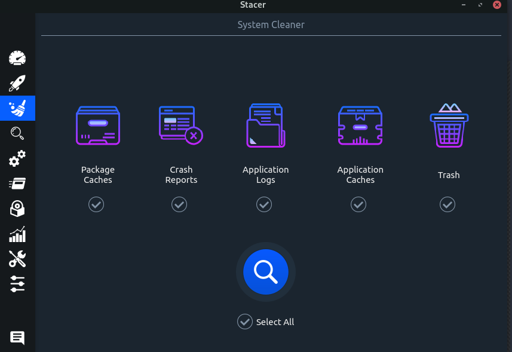

```bash
sudo pacman -S stacer
```

- zathura

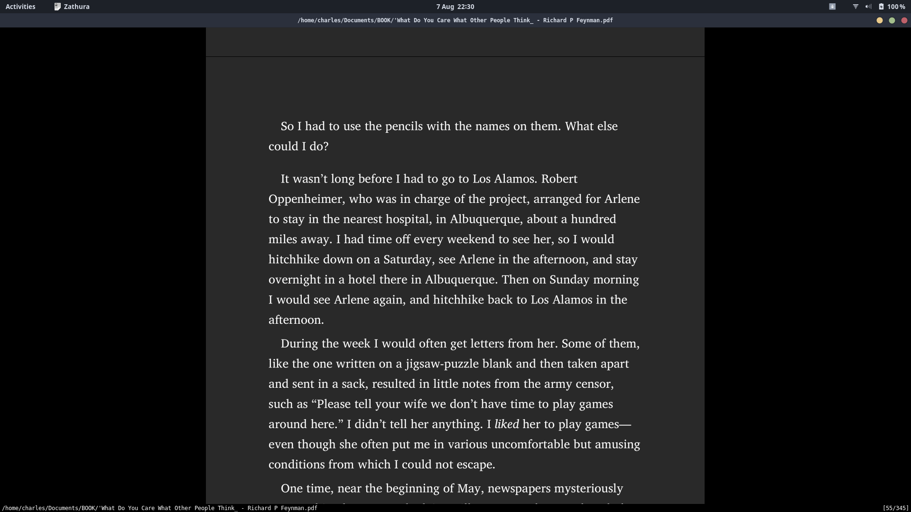

地址：https://pwmt.org/projects/zathura/

这是一个高拓展性的阅读器，在zathurarc中你可以自己配置zathura

```bash
sudo pacman -S zathura
```

如果要阅读pdf文件：

```bash
sudo pacman -S zathura-pdf-mupdf 
```

zathura阅读器是通过插件来加载文件的，对于pdf，你也可以选择poppler。

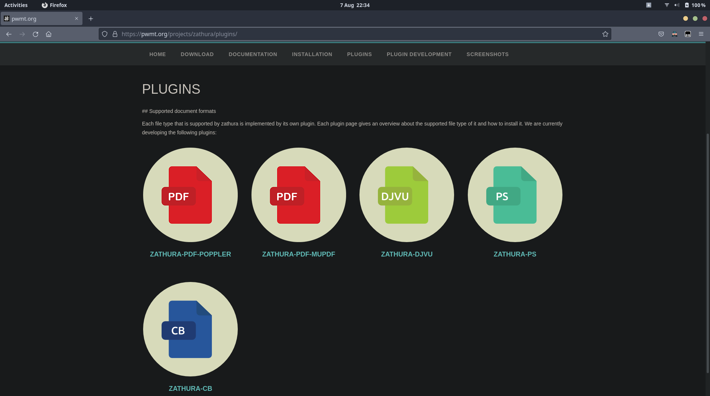

zathura基本用法：

```shell
ctrl+ r    反色
ctrl+ f    向下滚动一页
ctrl+ b    向上滚动一页
Tab        打开/关闭 目录
r          旋转90度
+，-       放大/缩小
```

详细用法参见zathura文档。

zathura我个人只配置了三行

```bash
vim ~/.config/zathura/zathurarc   
```

如果要改的话，把下面着三行复制进去，其中前两行是调整了配色，第三行是文本选中复制，相关说明在官网也有。

```shell
set recolor-darkcolor "#fafafa"
set recolor-lightcolor "#292929"
set selection-clipboard clipboard
```


- 字典：

如果有离线词典的话推荐用goldendict

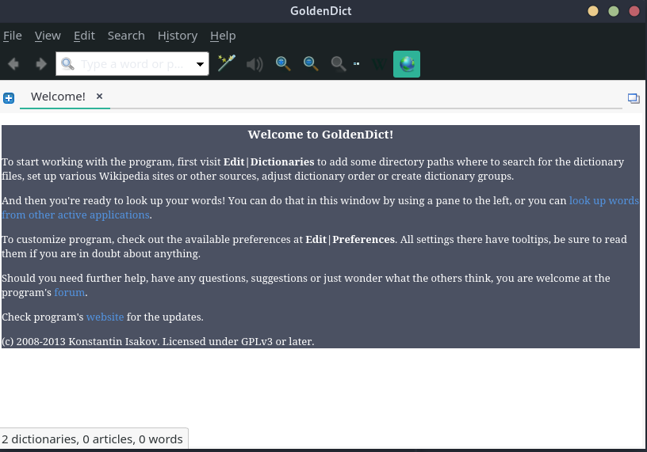

```bash
pamac build goldendict
```

如果想用在线词典的话有道词典有linux官方版本，aur里面也有相应版本，我个人使用的是命令行版本的wudao-dict：https://github.com/ChestnutHeng/Wudao-dict，如何安装readme里面写的十分详细，如果没法看github，那么可以自己clone下来然后看readme文件。

```bash
git clone https://github.com/chestnutheng/wudao-dict
```

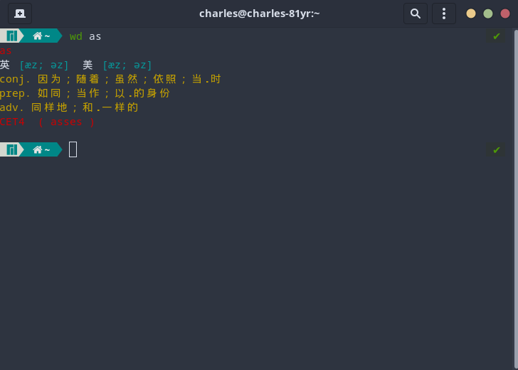

- qq

下面是基于deepin-wine实现是windows版本的tim在arch下的安装：https://github.com/countstarlight/deepin-wine-tim-arch

```bash
pamac build deepin-wine-tim
```

不过个人大多情况下用的是linuxqq，如果需要屏幕共享的话还是使用wine版本的吧，如果<font color=red>共享屏幕或者截图是黑色</font>，参照问题解决方案最后一条

```bash
pamac build linuxqq
```

- 微信

```bash
pamac build deepin-wine-wechat
```

也是基于deepin-wine的，但是这个体验还可。https://github.com/countstarlight/deepin-wine-wechat-arch

- calibre

这是个比较大而全的图书管理软件，自然的功能多来也就臃肿：https://calibre-ebook.com/

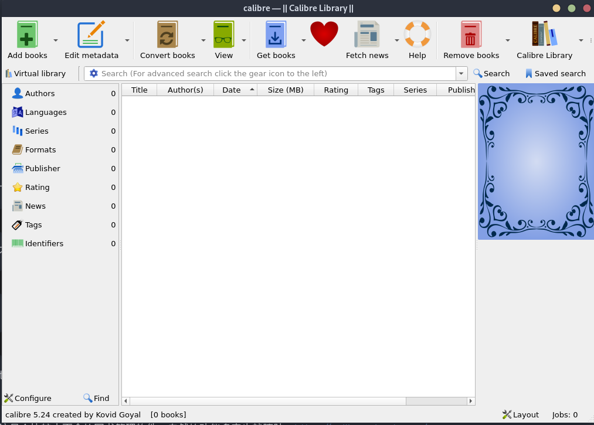

安装的话官网写着，你也可以在aur源里面进行安装

```bash
pamac build calibre
```


### 美化

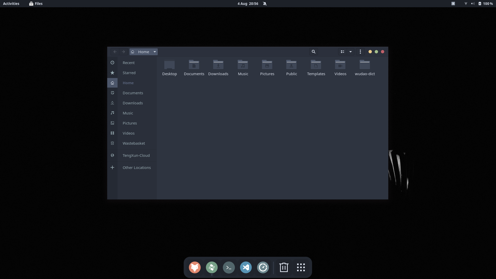

首先去gnomelook寻找合适主题，我就按照我自己配置的主题来说明了：https://www.gnome-look.org/p/1267246

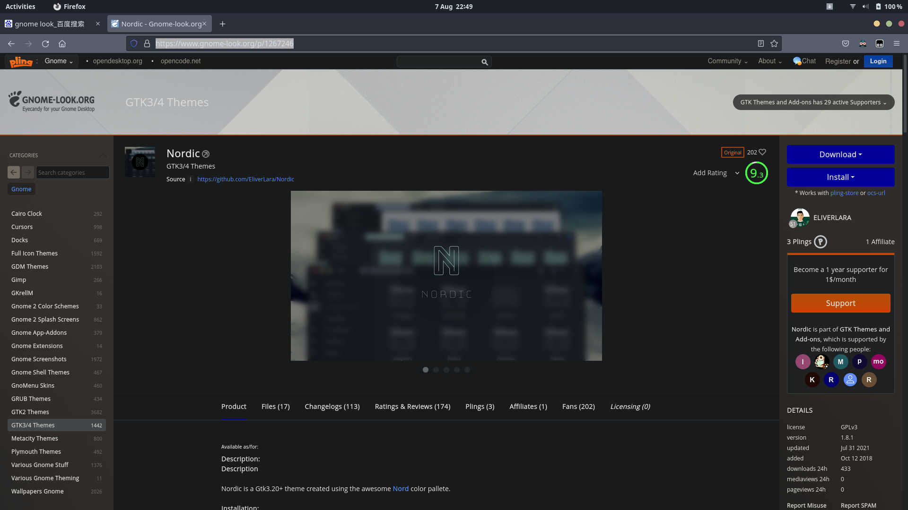

首先找到他的github主页，一般在名称下面：https://github.com/EliverLara/Nordic

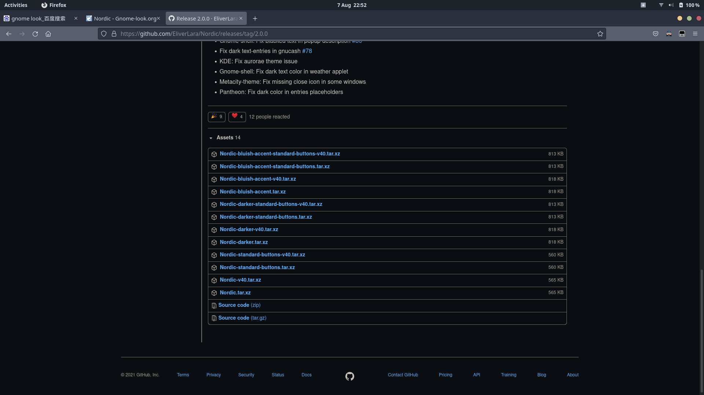

在release里面选择自己喜欢的主题，而后按照他说的把文件夹放到~/.themes/下，这里如果图形化界面找不到的话，按下<font color=red>ctrl+h</font>显示隐藏文件夹。

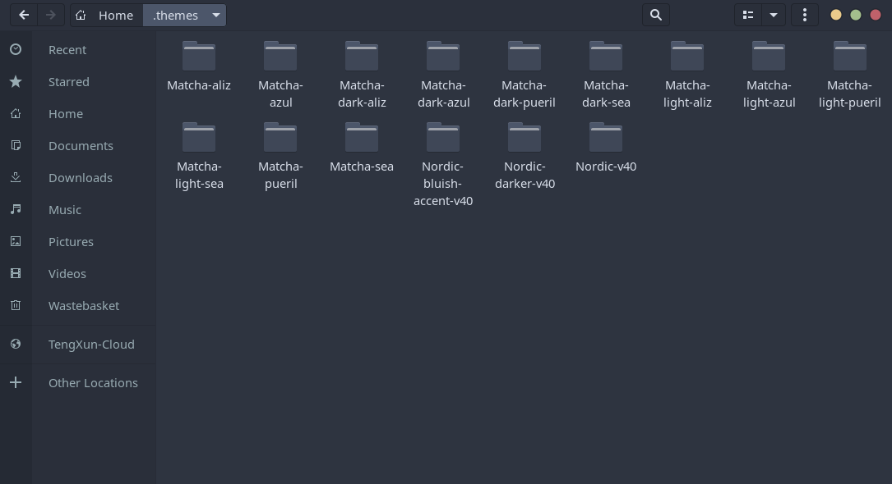

而后搜索tweaks，你不出意外就会看到，gnome主题调整与设置不放在一起，这一点饱受诟病。

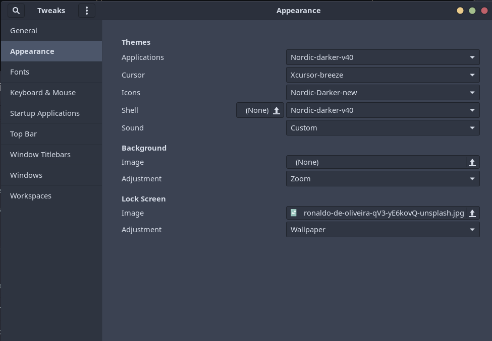

图标：https://www.gnome-look.org/p/1473069/

这个没有gihub主页，那就直接下载，但是有时候会卡住。按照他的说法复制到~/.local/share/icon下然后去tweaks选择就可。

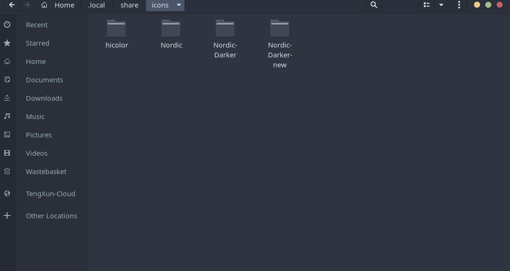


### 问题解决方案

manjaro使用中会不可避免的出现一些问题，本教程中显然没法做到面面俱到，我们仅仅就一些问题为例，向读者展示如何处理遇到的问题，以及如何搜索答案。

1:安装virtualbox出错：

首先如果我们通过pacman安装大概率会显示我们无法创建虚拟机，这时候就得求助manjarowiki

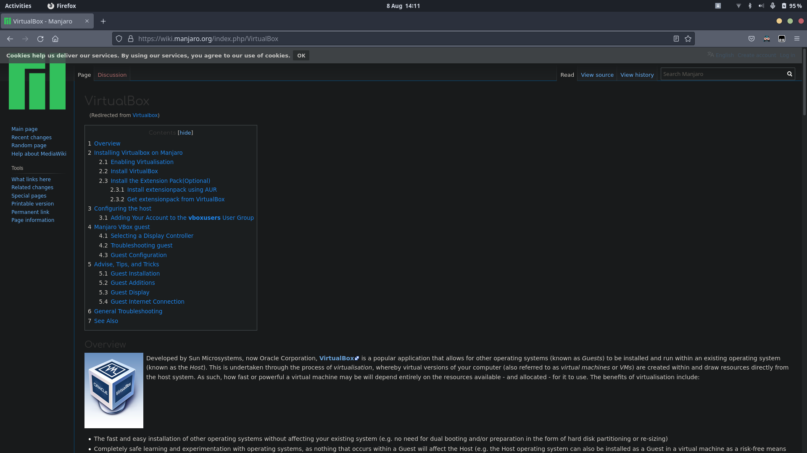

我们可以看到，他还会让我们安装内核模块，那么按照他给的步骤自行安装即可

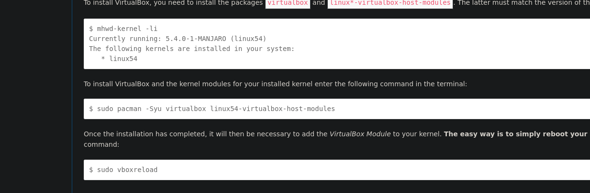

2:安装obs后录屏显示黑色：

这是因为默认wayland桌面obs不支持，办法是换成x11，<font color=red>linux下绝大多数截屏或者录屏失败都可以归结为此种原因。</font>

```bash
sudo vim /etc/gdm/custom.conf
```

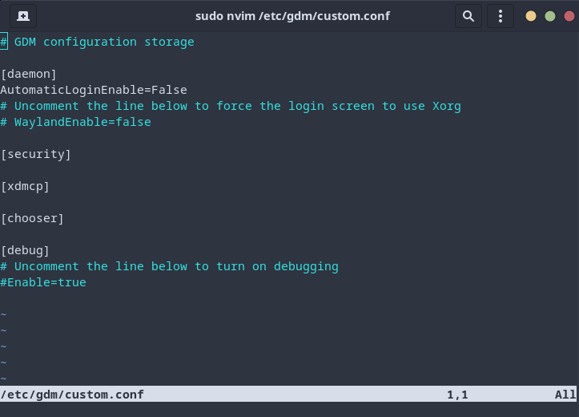

而后把wayland那行前面反注释，重启。

虚拟摄像头无法开启：查看obs官方论坛，你会找到相关帖子，以及相关答案

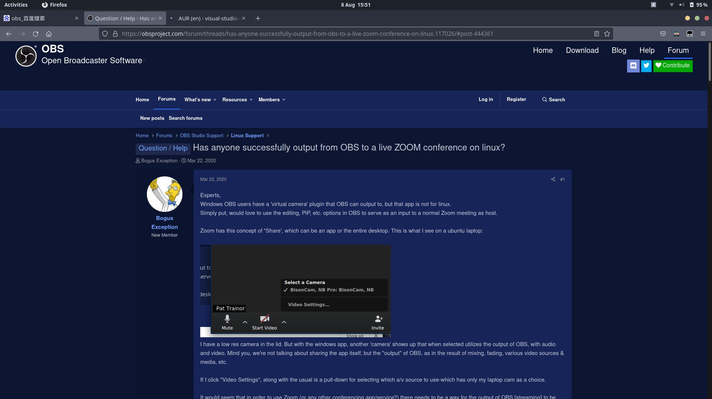

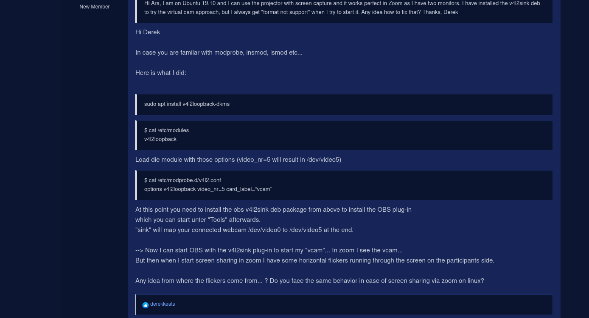

而如果说安装出错的话，大概率问题是没有安装linux-headers，再去manjaro wiki中寻找安装headers的方法就可，

如果出现问题，可以在下面几个网站搜索：manjaro wiki/arch wiki/manjaro forums/arch forums，相关软件如果有官网最好先去官网论坛或者wiki看一下，如果都不行，那就google搜索。


编辑：charleschetty


参考：

KagarinoKirie Studio ：https://archlinuxstudio.github.io/

manjarowiki：https://wiki.manjaro.org/index.php/Main_Page

Github国内mirror加速：https://blog.csdn.net/networken/article/details/105122778?

Manjaro-KDE安装配置全攻略：https://zhuanlan.zhihu.com/p/114296129

必须要了解的Manjaro包管理常用命令：https://zhuanlan.zhihu.com/p/346508211

